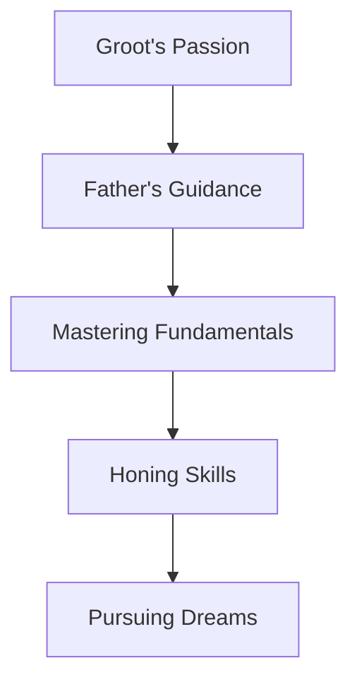

import { Callout, Steps, Step } from "nextra-theme-docs";

# A Childhood Passion

From the moment Groot could walk, he was enchanted by the sights and sounds of the baseball diamond. Born and raised in the heart of the city, his earliest memories were inextricably intertwined with the crack of the bat and the roar of the crowd.

<Callout emoji="💡">
Baseball was more than just a game for young Groot; it was a way of life, a passion that burned brighter than the stadium lights illuminating the evening sky.
</Callout>

While other children immersed themselves in video games or playground antics, Groot's world revolved around the timeless dance of pitcher, batter, and ball. He would spend hours watching games, studying the intricate strategies and mechanics of the sport, his eyes alight with wonder and determination.

<Steps>

### Step 1: A Love Ignited
Groot's love affair with baseball began in earnest when his father, a former player himself, introduced him to the game. Together, they would venture to the local sandlot, where his father would impart the wisdom and techniques he had acquired over years of dedication.

With each swing of the bat and every catch in the outfield, Groot's passion for the sport blossomed, fueled by the unwavering support and guidance of his father.

### Step 2: Mastering the Fundamentals
As Groot grew older, his father's teachings became more nuanced, delving into the finer points of the game. They would analyze pitching mechanics, study batting stances, and discuss the intricate strategies that separate good players from great ones.

Eager to absorb every lesson, Groot would spend countless hours practicing, honing his skills with a dedication that belied his young age. The sandlots and city streets became his personal training grounds, where he could perfect his swing, sharpen his fielding, and develop a deep understanding of the game he loved so dearly.

</Steps>

As Groot's skills blossomed, so too did his dream of one day stepping onto the hallowed grounds of a professional baseball field. With every passing year, his determination grew stronger, fueled by the unwavering support of his family and the belief that greatness was within his reach.

<Callout emoji="⚾">
In the end, Groot's childhood passion for baseball was not merely a fleeting interest but a profound calling, a path that would shape the course of his life and etch his name into the annals of the sport's legends.
</Callout>

With the foundations laid, Groot's journey had only just begun. The road ahead was paved with challenges and triumphs, but armed with the lessons of his youth and an unquenchable thirst for greatness, he was poised to conquer the baseball world, one pitch at a time.

[Continue to The Road to the Big Leagues](/road-to-big-leagues)