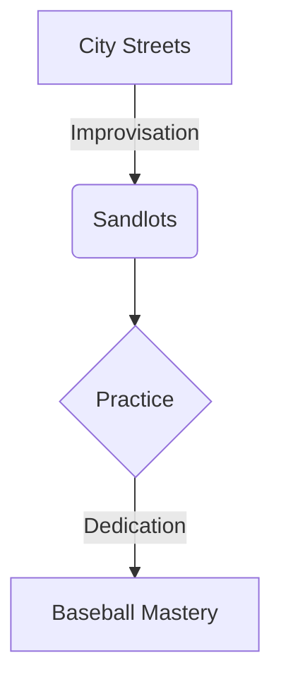

import { Callout, Steps, Step } from "nextra-theme-docs";

# City Streets and Sandlots

From the moment Groot could grip a baseball, the city streets and sandlots became his playground, a canvas upon which his love for the game flourished. The bustling metropolis that birthed his dreams was a labyrinth of concrete and steel, but within its heart beat the rhythmic pulse of America's pastime.

In the early morning hours, before the commuters descended and the streets came alive, Groot would venture out to the nearby sandlot, his trusty glove tucked under his arm. There, amidst the worn dirt and faded chalk lines, he would practice for hours on end, honing his skills with a dedication far beyond his years.

<Callout emoji="⚾">
The crack of the bat echoing through the urban canyons became a familiar soundtrack, a rallying cry that drew other young dreamers to the sandlot, united in their pursuit of baseball glory.
</Callout>

As the sun climbed higher in the sky, the city transformed into a concrete jungle, teeming with life and opportunity. Undeterred, Groot would seize every chance to play, turning alleyways into makeshift pitching lanes and empty lots into impromptu batting cages.

<Steps>
### Step 1
Find an open space, no matter how small or unconventional.

### Step 2
Clear the area of any obstacles or hazards, ensuring a safe playing environment.

### Step 3
Gather your equipment – a bat, a ball, and the unwavering determination to practice your craft.

### Step 4
Immerse yourself in the rhythm of the game, blocking out the cacophony of the city and focusing solely on the satisfying thwack of the ball meeting the bat.
</Steps>

The city streets became Groot's training ground, a testament to his unwavering commitment and his ability to adapt to any environment. Whether it was a game of catch against the rough brick walls or a solo batting session in a dimly lit underpass, every moment was an opportunity to hone his skills and nurture his passion.

As Groot's talent blossomed, the city streets and sandlots became more than just playgrounds; they were the crucible in which his resilience and determination were forged. Each obstacle, whether a pothole or a stray car, taught him to think on his feet and adapt to any situation, preparing him for the challenges that lay ahead on the professional diamond.

It was on these urban battlegrounds that Groot learned the true essence of the game – the joy of camaraderie, the thrill of competition, and the indomitable spirit required to overcome adversity. In a world where dreams often fade beneath the weight of reality, Groot's unwavering love for baseball burned brighter than the neon lights that illuminated the city skyline.

[Explore Groot's journey further in [A Father's Guiding Hand](/childhood-passion/fathers-guiding-hand).]