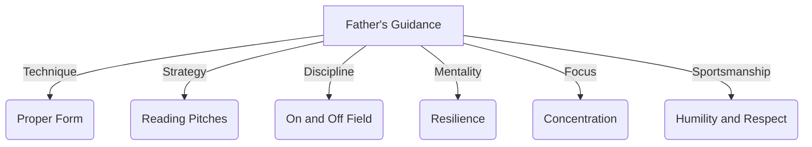

import { Callout, Steps, Step } from "nextra-theme-docs";

# A Father's Guiding Hand

Groot's love for baseball was not merely a fleeting passion but a legacy passed down from his father, a former player himself. From the moment Groot could swing a bat, his father recognized the spark of talent within him and nurtured it with unwavering dedication.

<Callout emoji="⚾">
In the world of sports, the bond between a parent and child often transcends the physical realm, becoming a conduit for shared dreams and a deep understanding of the game's nuances.
</Callout>

Groot's father had walked the same path, tasting the exhilaration of victory and the bitterness of defeat. He understood the sacrifices required to excel and the mental fortitude needed to overcome adversity. With this knowledge, he became Groot's mentor, guiding him through the intricacies of the game with patience and wisdom.

<Steps>

### Step 1: The Fundamentals

From an early age, Groot's father instilled in him the fundamental principles of baseball:

- The importance of proper form and technique
- The art of reading pitches and anticipating moves
- The value of discipline, both on and off the field

Through countless backyard sessions and trips to the batting cages, Groot's father imparted these lessons, ensuring that his son built a solid foundation upon which to grow his talents.

### Step 2: The Mental Game

Baseball, like life, is as much a mental battle as it is a physical one. Groot's father recognized this truth and dedicated himself to sharpening his son's psychological fortitude:

- Cultivating a resilient mindset to overcome failures and setbacks
- Developing a keen sense of focus and concentration
- Fostering a competitive spirit while maintaining sportsmanship

These invaluable lessons formed the bedrock of Groot's character, enabling him to persevere through the inevitable challenges that lay ahead.

</Steps>

Beyond the technical and mental aspects of the game, Groot's father served as a living embodiment of the values that define true sportsmanship: humility, respect, and an unwavering commitment to excellence. These virtues became ingrained in Groot's psyche, shaping not only his approach to baseball but also his character as a human being.

As Groot embarked on his journey towards baseball stardom, his father's guiding hand remained a constant presence, a source of strength and inspiration. Throughout the [trials and triumphs](/trials-and-triumphs), the lessons imparted by his father echoed in his mind, propelling him forward with unwavering determination.

In the annals of baseball history, countless tales have been woven of fathers and sons sharing a deep bond over the beloved game. Groot's story is a testament to the power of this connection, a vivid illustration of how a father's guidance can shape not only an athlete's skill but also their character and their approach to life itself.