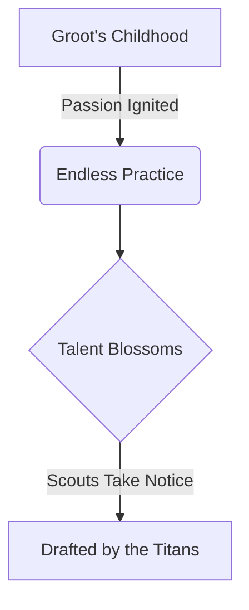

import { Callout, Steps, Step } from "nextra-theme-docs";

# The Rise of a Legend

In the heart of a bustling metropolis, where towering skyscrapers pierce the sky and the rhythmic pulse of city life echoes through every alleyway, a legend was born. This is the story of Groot, a baseball prodigy whose journey from the gritty streets to the hallowed grounds of the diamond is one of unwavering passion, unrelenting determination, and an indomitable spirit that refused to be deterred by any obstacle.

<Callout emoji="⚾">
Baseball is often referred to as America's pastime, a game that has captivated generations with its timeless allure. But for Groot, it was more than just a game – it was a way of life, a calling that resonated deep within his soul.
</Callout>

From a tender age, Groot's love for the sport blossomed like a fragrant flower amidst the concrete jungle. His father, a former player himself, had instilled in him the reverence for the game, teaching him the intricacies of each pitch and the artistry of swinging a bat. Those early lessons would lay the foundation for Groot's meteoric rise to greatness.

As he grew older, Groot's talent became undeniable, a beacon of hope shining through the city's gritty façade. His unwavering dedication to honing his skills knew no bounds, as he spent countless hours practicing under the scorching sun or the pale moonlight, perfecting his craft with a relentless fervor.

It was this relentless pursuit of excellence that caught the eye of scouts from far and wide, ultimately leading to Groot's drafting by the city's beloved team, the Titans. With his arrival, a new chapter in the storied franchise's history was about to unfold, one that would etch Groot's name into the annals of baseball legends.

<Steps>

### Step 1: Embrace the Journey

As Groot stepped onto the hallowed grounds of the Titans' stadium, he knew that his journey had only just begun. The path to greatness was paved with challenges and adversity, but it was a road he was prepared to traverse, fueled by an unwavering determination that burned brighter than a thousand suns.

### Step 2: Conquer the Doubters

In the early days of his professional career, Groot faced a chorus of doubters who questioned his ability to thrive on the big stage. But with each swing of his bat and every electrifying play in the field, he silenced the naysayers, proving that his talent was not a fleeting spark but a raging inferno that could not be extinguished.

</Steps>

With every game, Groot's legend grew, his feats of athleticism and raw power captivating fans and striking fear into the hearts of opposing teams. His humility and unwavering sportsmanship, however, remained steadfast, a testament to the values instilled in him by his family and upbringing.

As you delve deeper into [The Groot Chronicles](/childhood-passion/city-streets-sandlots), you'll discover the remarkable journey that transformed a wide-eyed dreamer into an unstoppable force on the diamond. Prepare to be inspired by tales of perseverance, determination, and the unwavering belief that anything is possible when you dare to chase your dreams.

<Callout emoji="🌟">
In the end, Groot's rise to legendary status serves as a beacon of hope for aspiring athletes everywhere, reminding us that greatness is not bestowed upon the chosen few but earned through the relentless pursuit of one's passion and an unwavering commitment to excellence.
</Callout>