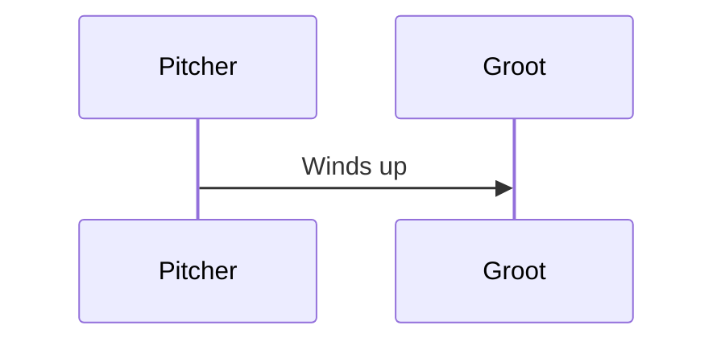

import { Callout, Steps, Step } from "nextra-theme-docs";

# The Ninth Inning

As the game entered its final inning, the tension in the air was palpable. The Titans found themselves trailing by a single run, with the weight of the entire season resting squarely on their shoulders. The crowd, a sea of passionate fans clad in the team's colors, held their collective breath, their eyes fixed on the field in anticipation.

<Callout emoji="⚠️">
In the crucible of this pressure-cooker moment, one player rose above the rest – Groot, the towering titan of the diamond, a living embodiment of resilience and determination.
</Callout>

As he stepped up to the plate, the unmistakable sound of his cleats echoed through the stadium, a rhythmic prelude to the drama that was about to unfold. The opposing pitcher, a formidable adversary in his own right, stared him down from the mound, their gazes locked in a silent battle of wills.

The first pitch whistled past, a blur of white against the backdrop of the night sky. Groot remained unfazed, his focus unwavering, his grip on the bat steady and sure. The second pitch followed, a tantalizing curveball that danced just outside the strike zone, tempting him to chase a futile swing.

But Groot was a master of discipline, his patience honed by countless hours of practice and experience. He watched the pitch sail by, his eyes tracking its every movement, his mind calculating the perfect moment to strike.

<Steps>

### Step 1: The Windup

The pitcher took a deep breath, his body coiling like a spring, every muscle taut with anticipation. In that brief moment, time seemed to slow, the world holding its breath in anticipation of what was to come.



### Step 2: The Pitch

With a violent explosion of motion, the pitcher unleashed a sizzling fastball, the ball hurtling towards Groot at breakneck speed. The crack of the bat echoed through the stadium like a thunderclap, as Groot's swing connected with the pitch in a perfect symphony of timing and power.

```latex
v = \sqrt{(v_0^2 + 2ad)}
```

The equation above represents the final velocity of a batted ball, where $v_0$ is the initial velocity of the pitch, $a$ is the acceleration imparted by the swing, and $d$ is the distance the ball travels from the point of contact to the sweet spot of the bat.

</Steps>

In that singular moment, time seemed to stand still, the world holding its breath as the ball soared majestically through the night sky. The crowds erupted in a deafening roar, their cheers carrying Groot's shot like a celestial comet, arcing higher and higher until it finally disappeared over the outfield wall.

As Groot rounded the bases, his teammates mobbed him in a joyous celebration, their collective triumph etched on their faces. But for Groot, the moment was one of quiet gratitude, a testament to the power of perseverance and the pursuit of one's dreams.

In the annals of baseball history, this game would forever be remembered as the night when a legend was born, when a young man from the city streets ascended to the pantheon of sporting immortality. And for generations to come, aspiring players would look to [Groot's indomitable spirit](/trials-and-triumphs/unbreakable-will) as a beacon of inspiration, a reminder that greatness is not reserved for the chosen few, but for those who dare to dream and have the courage to chase those dreams, no matter the odds.