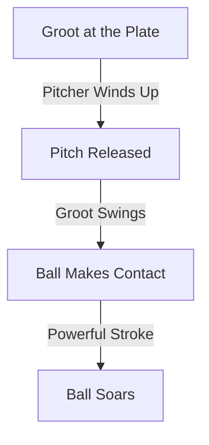

import { Callout, Steps, Step } from "nextra-theme-docs";

# A Swing for the Ages

In the annals of baseball history, certain moments transcend the game itself, etching themselves into the collective memory of fans and players alike. Groot's fateful swing during that unforgettable game was one such moment, a testament to the power of determination and the magic of the diamond.

As the tension reached a fever pitch in the [ninth inning](/night-to-remember/ninth-inning), every eye in the stadium was transfixed on Groot's imposing figure at the plate. The pitcher, a formidable opponent in his own right, wound up and unleashed a blistering fastball that seemed to defy the laws of physics.

<Callout emoji="⚾">
In baseball, the pitcher's fastball is considered one of the most challenging pitches to hit. It's a testament to Groot's skill and reflexes that he was able to connect with such a blazing delivery.
</Callout>

Time appeared to slow down as Groot's bat made contact with the ball, the resulting crack reverberating through the stadium like a thunderclap. The ball soared into the night sky, its trajectory a perfect parabola, as if guided by the hand of destiny itself.

<Steps>

### Step 1: The Swing

As Groot's bat connected with the ball, his immense strength and flawless technique were on full display. The swing was a masterclass in form and power, a symphony of muscle and precision.

### Step 2: The Flight

The ball's flight was a thing of beauty, a ballistic marvel that defied gravity and logic. It seemed to hang in the air for an eternity, as if suspended by invisible strings, before finally beginning its descent towards the outfield fence.

$$
y = x\tan(\theta) - \frac{1}{2}\frac{g}{v_0^2\cos^2(\theta)}x^2
$$

The equation above represents the trajectory of a baseball hit with an initial velocity $v_0$ at an angle $\theta$ above the horizontal, taking into account the effects of gravity ($g$).

### Step 3: The Landing

As the ball sailed over the outfield wall, the crowd erupted in a deafening roar of euphoria. In that moment, Groot had achieved the ultimate feat – a game-winning home run that would forever etch his name in baseball lore.

</Steps>

The sheer power and precision of Groot's swing were a sight to behold, a masterpiece of athletic prowess that left even seasoned veterans in awe. It was a moment that encapsulated the very essence of baseball – a game where triumph and heartbreak can coexist in a single, defining instant.

<Callout emoji="🏆">
Groot's game-winning home run was more than just a highlight-reel play; it was a symbol of his unwavering determination and the culmination of a lifelong journey. It was a moment that inspired countless aspiring players and reignited the passion of even the most jaded fans.
</Callout>

As Groot rounded the bases, his face beaming with a mixture of pride and disbelief, the stadium became a cathedral of celebration. Fans chanted his name, teammates embraced him, and even opposing players couldn't help but tip their caps in respect to a legend in the making.

In the days and weeks that followed, Groot's heroic feat would be dissected and analyzed from every possible angle, with pundits and experts alike trying to unravel the secrets behind that fateful swing. But for Groot himself, it was simply a manifestation of his lifelong love for the game, a moment that encapsulated the very essence of his journey [from city streets to baseball stardom](/rise-of-a-legend).