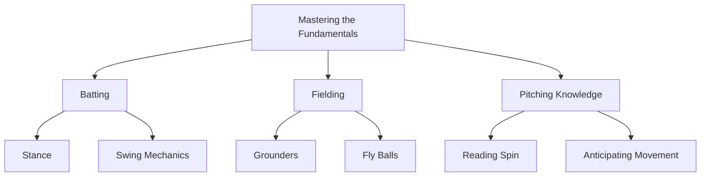

import { Callout, Steps, Step } from "nextra-theme-docs";

# Tireless Dedication

From an early age, Groot's commitment to baseball was unparalleled. His love for the game burned brighter than the scorching summer sun, fueling a relentless drive to hone his skills and push the boundaries of his potential.

<Callout emoji="⚾">
Groot's dedication to baseball was more than just a passion – it was a way of life.
</Callout>

As the city streets transformed into impromptu sandlots, Groot could be found tirelessly practicing his swing, his focus unwavering. Hours melted into days, and days into years, as he perfected every aspect of his game.

<Steps>

### Step 1: The Fundamentals

Before Groot could soar to the heights of greatness, he had to master the fundamentals. With his father's guidance, he spent countless hours:

- Perfecting his batting stance and swing mechanics
- Honing his fielding abilities, from grounders to fly balls
- Studying the nuances of pitching, reading spin, and anticipating movement

### Step 2: Strength and Conditioning

To withstand the grueling demands of a long season, Groot dedicated himself to a rigorous strength and conditioning regimen, leaving no stone unturned in his quest for physical excellence:

- Weight training to build explosive power and endurance
- Agility drills to improve quickness and reaction time
- Cardiovascular exercises to enhance stamina

</Steps>

But Groot's dedication extended far beyond the physical realm. He spent hours poring over scouting reports, studying game footage, and analyzing the tendencies of opposing players. His mental preparation was as meticulous as his physical training.

<Callout emoji="📚">
Groot's relentless pursuit of knowledge and understanding of the game set him apart from his peers.
</Callout>

Whether it was the blistering heat of summer or the bitter chill of winter, Groot's commitment never wavered. Rain or shine, day or night, he could be found on the field, refining his craft with an unwavering determination that would inspire generations to come.

As Groot ascended through the ranks, his dedication only intensified. Each level brought new challenges, but his tireless work ethic remained a constant, propelling him ever closer to his ultimate dream of [baseball stardom](/road-to-big-leagues/titan-emerges).

Through the lens of Groot's journey, we are reminded that true greatness is not bestowed upon us; it is forged through the crucible of unwavering dedication and an insatiable hunger for excellence.