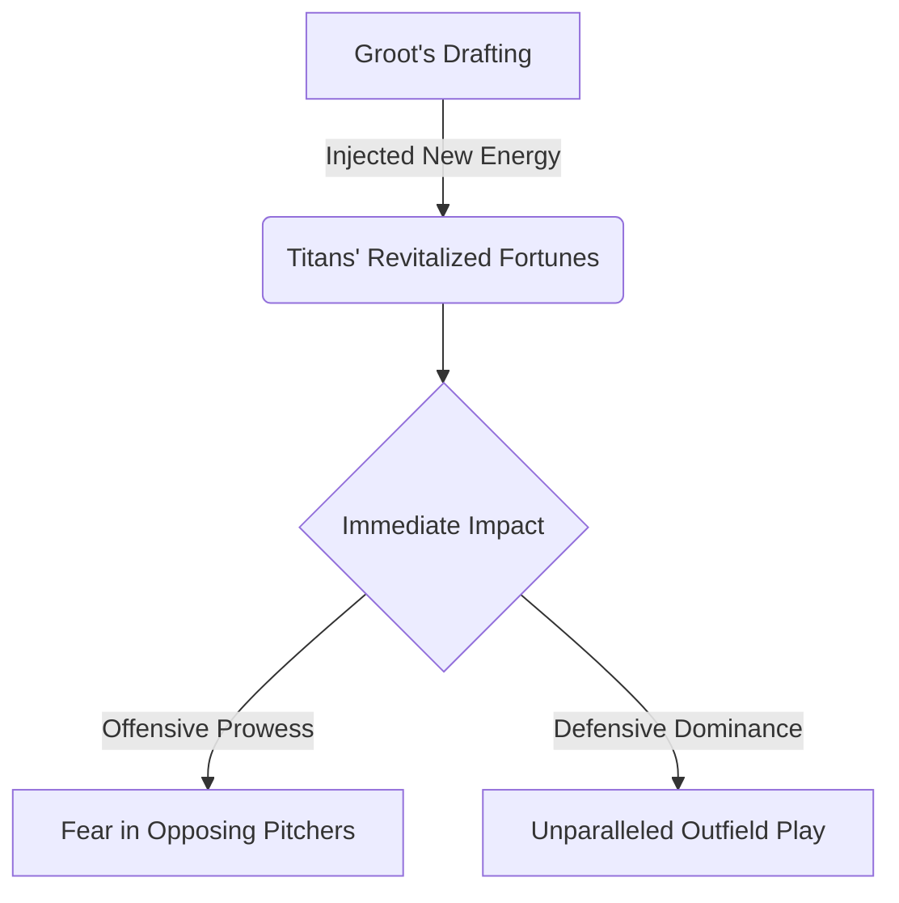

import { Callout, Steps, Step } from "nextra-theme-docs";

# A Titan Emerges

With his unwavering dedication and exceptional talent, it was only a matter of time before Groot's path led him to the pinnacle of the sport. The city's beloved team, the Titans, recognized the prodigious young player's potential and wasted no time in securing his services.

<Callout emoji="⚡">
The moment Groot's name was called on draft day marked the beginning of a new era for the Titans and the city's baseball legacy.
</Callout>

Groot's arrival was like a breath of fresh air for the team, injecting a newfound energy and determination into their ranks. His presence on the field seemed to galvanize his teammates, inspiring them to reach new heights with each game.

<Steps>

### Step 1: Seamless Transition

Despite the immense pressure that comes with joining a professional team, Groot's transition to the big leagues was remarkably smooth. His years of [tireless dedication](/road-to-big-leagues/tireless-dedication) had prepared him well for this moment, and he embraced the challenge with open arms.

### Step 2: Making an Immediate Impact

From his very first game, Groot left an indelible mark on the Titans' fortunes. His towering presence at the plate struck fear into the hearts of opposing pitchers, while his lightning-quick reflexes and cannon-like arm in the outfield made him a defensive force to be reckoned with.

</Steps>

With each game, Groot's legend grew, and the city's fervor for their new baseball hero reached fever pitch. Fans flocked to the stadium, eagerly anticipating the young phenom's next jaw-dropping feat:

* A towering home run that seemed to defy the laws of physics?
* A gravity-defying catch that left spectators speechless?
* A laser-beam throw from the outfield, cutting down a runner with pinpoint precision?

No matter the challenge, Groot rose to the occasion, leaving a trail of awe-struck spectators in his wake.

<Callout emoji="💡">
It was as if the baseball diamond was Groot's personal canvas, and he was a master artist, painting masterpieces with every swing of the bat and every dive in the field.
</Callout>

In the blink of an eye, Groot had transformed from a promising young talent to a bonafide superstar, his name etched into the hearts and minds of baseball fans across the city. The Titans had found their new leading man, and the stage was set for a legendary career unlike any other.