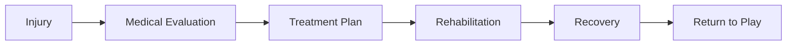

import { Callout, Steps, Step } from "nextra-theme-docs";

# Battling Adversity

In the realm of sports, where glory and triumph are celebrated, the path to greatness is often paved with obstacles and adversities that test the mettle of even the most seasoned athletes. For Groot, the towering figure whose exploits on the baseball diamond etched his name into the annals of the game, these challenges were not mere speed bumps but formidable hurdles that threatened to derail his meteoric rise.

<Callout emoji="⚠️">
Every legend's journey is marked by moments of adversity, where the true depth of their character and resolve is forged in the fires of hardship.
</Callout>

As Groot ascended through the ranks of the Titans, his prodigious talent and unwavering dedication propelled him to heights few could match. Yet, even for a player of his caliber, the perils of the game loomed ever-present, ready to strike at any moment.

Injuries, those cruel and unforgiving foes, cast their insidious shadows across Groot's path. Whether a twisted ankle, a strained muscle, or a nagging ailment that refused to heal, each setback presented a new challenge to overcome.

<Steps>

### Step 1

Seek Medical Attention: When an injury strikes, Groot's first priority was to seek immediate medical attention from the team's physicians and trainers. Proper diagnosis and treatment were crucial to ensuring a full recovery and minimizing the risk of further complications.

### Step 2

Rehabilitation and Recovery: With a clear understanding of the nature of his injury, Groot embarked on a rigorous rehabilitation program tailored to his specific needs. This often involved countless hours of physical therapy, strength training, and conditioning exercises, all aimed at restoring his body to peak condition.

### Step 3

Mental Fortitude: While the physical aspects of recovery were paramount, Groot understood the importance of maintaining a strong mental fortitude. He refused to let setbacks shatter his confidence or diminish his passion for the game. Through visualization techniques, positive self-talk, and a unwavering belief in his abilities, he cultivated a resilient mindset that propelled him forward.

</Steps>

Yet, Groot's battles extended beyond the physical realm. The weight of expectations, the scrutiny of the media, and the doubts of naysayers threatened to cast a pall over his achievements. In those moments, his determination shone like a beacon, guiding him through the storm.

<Callout emoji="💡">
Groot's unwavering determination and mental fortitude were the foundations upon which his legendary status was built, enabling him to overcome every obstacle and emerge stronger on the other side.
</Callout>

Through it all, Groot remained steadfast in his commitment to the game he loved. Each setback was not a reason to surrender but an opportunity to grow, to learn, and to emerge as a more formidable force on the diamond.

As he navigated the treacherous waters of adversity, Groot's resilience became a beacon of inspiration for his teammates, his fans, and aspiring athletes everywhere. His unwavering dedication to overcoming every challenge served as a testament to the power of perseverance and the indomitable spirit that lies within us all.

For those who dare to dream of greatness, Groot's battles against adversity serve as a reminder that the path to glory is paved with hardships, but it is through these trials that true champions are forged.