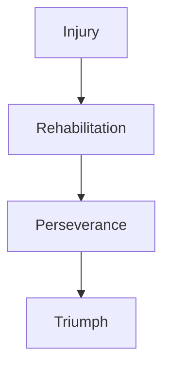

import { Callout, Steps, Step } from "nextra-theme-docs";

# An Unbreakable Will

In the world of sports, where dreams are forged on fields of glory, true greatness is measured not only by skills and accomplishments but also by the indomitable spirit that fuels them. For Groot, this unbreakable will was the driving force that propelled him through every obstacle and setback, transforming each challenge into a testament of his unwavering determination.

<Callout emoji="⚡">
Groot's resilience was a beacon of inspiration, reminding us all that the path to greatness is paved not with smooth roads but with the grit and perseverance to overcome every hurdle that stands in our way.
</Callout>

Throughout his illustrious career, Groot faced numerous injuries and adversities that threatened to derail his journey. From the nagging aches and pains that come with the territory of being a professional athlete to the more severe setbacks that could have ended careers, Groot refused to let any obstacle deter him from his ultimate goal.

<Steps>
### Step 1: Confront the Challenge
Whenever faced with an injury or setback, Groot's first step was to confront it head-on, with unwavering determination and a refusal to surrender. He understood that the road to success was never a straight line, and that true champions were forged in the fires of adversity.

### Step 2: Embrace the Healing Process
Rather than viewing the healing process as a burden, Groot embraced it as an opportunity to grow stronger, both physically and mentally. He dedicated himself wholeheartedly to rehabilitation, following the guidance of medical professionals and pushing himself to the limits of his endurance.

### Step 3: Renew the Commitment
With each obstacle overcome, Groot's commitment to his craft only deepened. He emerged from every challenge with a renewed sense of purpose, a burning desire to prove his doubters wrong and to reach even greater heights of achievement.
</Steps>

One of the most remarkable examples of Groot's indomitable spirit was his recovery from a career-threatening injury. After a devastating collision on the field, he found himself facing a long and arduous road to recovery, with many experts questioning whether he would ever play again.

However, Groot refused to accept defeat. With a steely determination that defied the odds, he attacked his rehabilitation regimen with the same intensity and focus that he brought to the game itself. Day by day, week by week, he pushed himself beyond his limits, until finally, against all expectations, he made his triumphant return to the field.

$\text{Groot's Resilience} = \frac{\text{Determination}}{\text{Obstacles}} \times \text{Perseverance}$

This indomitable spirit extended beyond the physical realm, as Groot also faced mental and emotional challenges throughout his career. From the pressure of living up to lofty expectations to the doubts and criticisms that inevitably arose during slumps or setbacks, he remained unwavering in his belief in himself and his abilities.

- Groot's unbreakable will allowed him to [block out the noise](/trials-and-triumphs/battling-adversity) and focus solely on the task at hand, never allowing external factors to shake his confidence or distract him from his goals.
- He understood that true greatness was not measured by the absence of challenges, but by the ability to overcome them, time and time again.
- Groot's resilience inspired his teammates, fans, and aspiring athletes alike, reminding them that with an unbreakable will, any dream was within reach.

In the end, it was this indomitable spirit, this unbreakable will, that elevated Groot from a mere athlete to a true legend of the game. His unwavering determination in the face of adversity served as a shining example of the power of perseverance, a testament to the fact that no obstacle is insurmountable for those who refuse to be defeated.